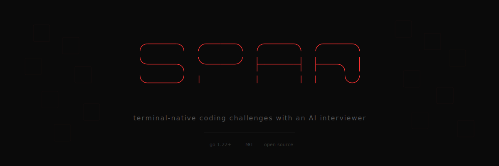

<p align="center">
  
</p>

<p align="center">
  <code>go install github.com/spar-cli/spar@latest</code>
</p>

<p align="center">
  <a href="#install"></a>
  <a href="LICENSE"></a>
  <a href="#contributing"></a>
</p>

---

spar is a terminal-based coding challenge platform with a built-in editor and an AI interviewer. It runs entirely offline from a local repo — no accounts, no browser, no backend. Open source, free forever.

<!--
TODO: Replace with actual terminal screenshots once the UI is finalized.
Take these with a clean terminal at ~120 cols, dark theme.

<p align="center">
  
</p>
-->

## What it does

You pick a challenge, write your solution in spar's editor, and run the tests. If you've set up an AI provider, it'll ask you questions about your approach while you work — the same kind of stuff you'd hear in a real interview. "What's the time complexity here?", "What happens if the input is empty?", that sort of thing.

The editor blocks paste. Not to be annoying — just to keep things honest. If you're prepping for an interview, practicing without a clipboard is the whole point.

```
$ spar
```

<!--
TODO: Screenshot of a coding session with the split layout —
problem on left, editor on right, AI chat at bottom.

<p align="center">
  
</p>
-->

## AI modes

spar has three modes depending on what you're after:

**Interview** — the AI watches your progress and asks follow-up questions mid-session. It'll push back on your approach, ask about edge cases, and give you a debrief when you're done.

**Practice** — you can ask the AI for help, but it won't give you code. It'll nudge you toward the right idea without handing you the answer.

**Post-mortem** — after you solve (or give up), it walks through optimal approaches and compares them to what you wrote.

All three are optional. spar works fine without AI — you just won't get the interview pressure.

## Challenges

165 challenges across 8 collections, each with setup code and solutions in Python, Go, JavaScript, C++, and Rust.

| Collection | Count | |
|-----------|-------|-|
| The Foundation | 75 | Arrays, trees, graphs, DP — the core patterns |
| System Design Lite | 15 | LRU caches, rate limiters, circuit breakers |
| Concurrency | 10 | Producer-consumer, dining philosophers, deadlocks |
| Data Structures | 15 | Hash maps, heaps, AVL trees — build them yourself |
| Bit Manipulation | 15 | The one everyone skips until it shows up |
| Recursion Deep Dive | 10 | Constraint satisfaction, pruning, backtracking |
| Real-World Patterns | 15 | JSON parsers, cron expressions, diff algorithms |
| Language Idiomatic | 10 | Same problem, different idiomatic solution per language |

There's also 10 **mock interview sets** — curated groups of 3 problems meant to simulate a 45-minute screen. The AI treats the whole set as one session.

Every challenge lives in the repo as a folder:

```
challenges/arrays/two-sum/
├── challenge.yaml       # description, constraints, hints
├── tests.yaml           # visible + hidden test cases
├── setup/               # starting code per language
└── solutions/           # reference solutions per language
```

Anyone can add challenges via PR.

## Ranking

spar tracks your progress with a ranking system. You earn SP (spar points) for each solve — more for harder problems, faster solves, clean first-attempt runs, and strong AI interview scores.

```
  ◁◆▷  Sentinel II
  ████████████░░░░░░░  3,920 / 5,800 SP
```

Seven ranks: **Spark** → **Cipher** → **Warden** → **Sentinel** → **Arbiter** → **Sovereign** → **Mythic**, each with three divisions. Complete entire collections to earn track medals (bronze, silver, gold) for bonus SP.

Everything is local. You're not competing with anyone — just tracking your own progress.

## Install

**Recommended:**

```bash
go install github.com/spar-cli/spar@latest
```

**From source:**

```bash
git clone https://github.com/spar-cli/spar.git
cd spar
go build -o spar ./cmd/spar
```

On first run, spar walks you through setup — repo path, preferred language, AI provider (or none).

### Languages

spar uses whatever toolchains you already have installed:

| Language | Needs |
|----------|-------|
| Python | `python3` |
| Go | `go` |
| JavaScript | `node` |
| C++ | `g++` |
| Rust | `rustc` |

You only need the ones you want to use.

## Config

```yaml
# ~/.config/spar/config.yaml
repo_path: ~/code/spar
default_language: go
ai_provider: claude    # claude | openai | none
editor_tab_width: 4
```

User data (stats, session history) lives in `~/.local/share/spar/`. Both directories are created on first run.

## CLI

```
spar                    Launch the TUI
spar generate-index     Rebuild the challenge index
spar validate           Check all challenge folders
spar validate <path>    Check a specific challenge
spar version            Print version
```

## Contributing

New challenges are the most useful contribution. The process:

1. Fork the repo
2. Create your challenge folder under `challenges/{category}/`
3. Run `spar validate` to check the structure
4. Run `spar generate-index` to update the index
5. Open a PR

CI runs the full validation — structure, completeness, and it actually executes every solution against every test case. If it's green, you're good.

Challenges need original descriptions, at least 2 visible and 3 hidden test cases, and idiomatic solutions in all supported languages.

## License

[MIT](LICENSE)

---

<p align="center">
  <sub>code under pressure.</sub>
</p>